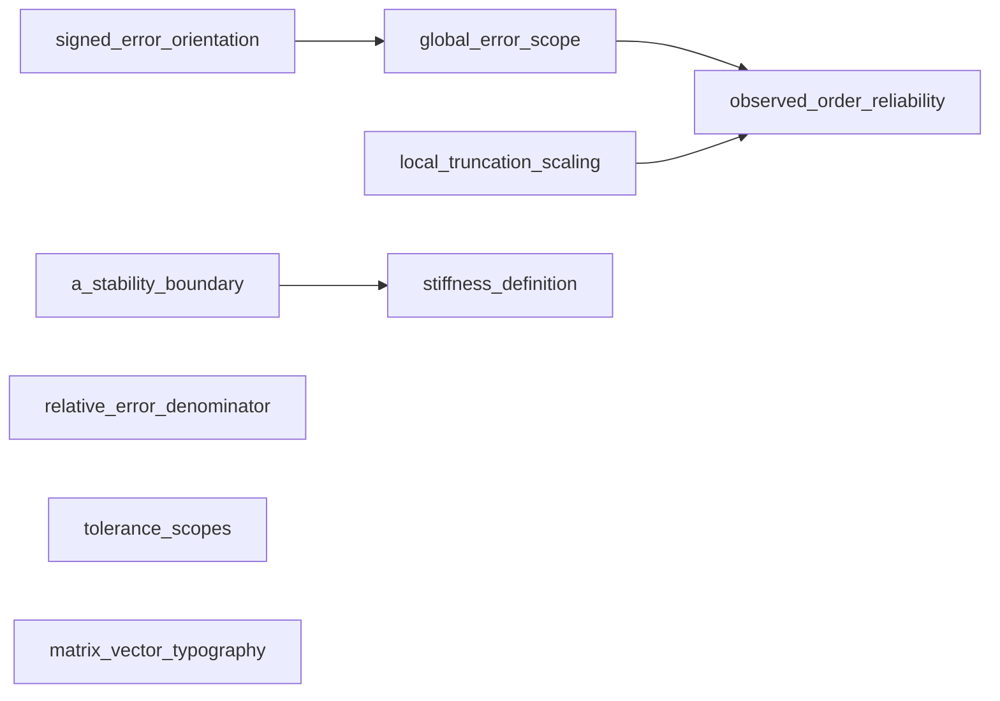

# Numerical T-Lab Project Language - Maintainer Decision Packet

Status: Decision packet complete; all choices remain maintainer-pending.

## Executive summary

This packet prepares, but does not approve, the nine unresolved terminology and
notation choices in the Numerical T-Lab content foundation. The nine conflict
records account for all 18 `DECISION_REQUIRED` term and notation rows: several
rows roll up to one decision, and no hidden tenth conflict was found.

The recommended set favors explicit mathematical objects, metric-specific
labels, qualified stability and tolerance language, and preservation of the
released Convergence contract. Five recommendations have High confidence,
three Medium confidence, and one Low confidence. Every recommendation is
advisory. The standards, catalog, copy audit, runtime, and production Glossary
remain unchanged.

## How to use this packet

1. Review cards in the documented order.
2. Select one option or Defer in each blank decision form.
3. Record exceptions and rationale, especially when choosing against the
   source-priority recommendation.
4. Complete the separate
   [Project Language Approval Checklist](PROJECT_LANGUAGE_APPROVAL_CHECKLIST.md).
5. Authorize a separate standards-promotion commit only after the required
   choices are recorded.

An approval recorded here is a content-governance decision. It does not itself
change runtime behavior, product copy, tests, or production Glossary content.

## Source and evidence policy

The review used the approved private corpus only, in this priority:
`NOTES-2025` -> relevant `NLA-CHxx` -> `CHENEY` -> maintainer judgment. Source
priority guides project language but does not override mathematical truth.

Every cited private source is represented only by an abstract source key and a
short locator. The comparisons are original paraphrases. No private path,
basename, hash, screenshot, raw extraction, or long quotation is included.
`CHENEY` is image-only, so its claims below come from bounded visual review of
the cited pages. A silent source is reported as `No direct evidence found`;
silence is not agreement.

Current-project usage was checked against active source, Tutor language,
current documentation, and copy-encoding tests. DEV-only fixtures and
historical specs/reviews were classified separately and excluded from
migration counts.

## Decision inventory

| Review | Decision ID | Affected term IDs | Affected notation rules | Category | Urgency | Dependency | Affected modules | Migration breadth | Production-blocking status |
|---:|---|---|---|---|---|---|---|---|---|
| 1 | `signed_error_orientation` | `nodal_error`, `global_error`, `absolute_error` | Signed nodal error; Global ODE error | notation choice; definition-scope choice; Tutor language policy | High | Foundation for `global_error_scope` | Shared language; ODE; Tutor; future PDE | Small now; Medium when signed content ships | Blocks Tutor and any signed-error content |
| 2 | `global_error_scope` | `global_error`, `nodal_error`, `final_time_error`, `maximum_global_error`, `observed_order` | Global ODE error; Final-time error; Maximum global error | mathematical-sense separation; UI label choice; definition-scope choice | High | Depends on review 1; precedes review 4 | ODE; Convergence; Tutor; future PDE | Medium current copy; broad future reuse | Blocks IVP, Convergence, Tutor, and Glossary wording |
| 3 | `local_truncation_scaling` | `local_truncation_error`, `truncation_error`, `order_of_convergence` | Local truncation error | notation choice; definition-scope choice; Tutor language policy | High | Contributes to review 4 teaching | ODE; Tutor; future PDE | Medium current Tutor; cross-module later | Blocks Tutor and Glossary definitions |
| 4 | `observed_order_reliability` | `observed_order`, `asymptotic_region`, `order_of_convergence`, `convergence` | Observed order | mathematical-sense separation; UI label choice; pedagogical wording | High | Depends on reviews 2 and 3 for explanations | ODE; Convergence; Tutor | Medium across released teaching surfaces | Blocks Convergence, Tutor, and Glossary wording |
| 5 | `a_stability_boundary` | `a_stability`, `absolute_stability`, `stability_function`, `stability_region`, `step_size` | Stability test equation; Stability function; Stability region | notation choice; mathematical-sense separation; Tutor language policy | High | Foundation for review 6 | ODE; Tutor; future PDE | Medium current copy and future plots | Blocks IVP method, Tutor, and Glossary formulas |
| 6 | `stiffness_definition` | `stiffness`, `absolute_stability`, `step_size` | No standalone symbol; uses stability and step-size rules | definition-scope choice; pedagogical wording; module-specific override | High | Depends on review 5 | ODE; Tutor; future PDE | Medium current preset/Tutor; broad future reuse | Blocks IVP preset, Tutor, and Glossary definitions |
| 7 | `relative_error_denominator` | `relative_error`, `absolute_error` | Relative error | definition-scope choice; notation choice; UI label choice | Medium | Independent | Shared error language; future NLA/PDE | Small now; Medium for future metric UI | Blocks any relative-error UI or Glossary entry |
| 8 | `tolerance_scopes` | `tolerance`, `residual`, `convergence` | Nonlinear residual and named threshold rules | canonical term choice; mathematical-sense separation; Tutor language policy | Medium | Independent | ODE nonlinear solves; Tutor; future adaptive solvers | Medium current documentation/Tutor; broad future governance | Blocks Tutor and any tolerance-facing UI |
| 9 | `matrix_vector_typography` | `scalar`, `vector`, `matrix`, `linear_system`, `residual`, `vector_norm`, `matrix_norm`, `condition_number` | Scalars; Vectors; Matrices; Linear systems; residuals and norms | notation choice; module-specific override; pedagogical wording | Low now, High before NLA | Independent and future-facing | Future Linear Algebra; PDE; Tutor; accessibility | None in current runtime; Large future formula surface | Blocks future Linear Algebra/PDE formulas |

The source locators are reproduced in the cards. The primary copy dependencies
are the IVP method catalog and preset language, Convergence labels and
interpretation, Tutor mock/system language, and future Linear Algebra copy.
The dependent Glossary candidates are exactly the affected term IDs above.

The 18 blocked candidate rows are not 18 independent decisions:

- the A-stability decision governs four stability candidates;
- the error-scope decisions govern several nodal and aggregate error rows;
- the observed-order decision also governs `asymptotic_region`;
- the typography decision governs scalar, vector, matrix, and related formula
  rules;
- tolerance and residual rows share one scope policy without reopening the
  already-aligned error-versus-residual distinction.

## Dependency-aware review order

The order above minimizes rewrites: establish signed error before defining the
global-error family; establish global and local error language before observed
order; establish absolute-stability notation before stiffness. Relative error,
tolerance scopes, and matrix/vector typography are independent and can be
reviewed later without invalidating earlier choices.

## Decision dependency graph



The `local_truncation_scaling` edge affects observed-order explanations, not
the numerical observed-order formula. The three isolated decisions are
independent of the other choices.

## Decision cards

### 1. `signed_error_orientation` - Signed nodal error

#### Decision identity

- **Affected term IDs:** `nodal_error`, `global_error`, `absolute_error`
- **Category:** notation choice; definition-scope choice; Tutor language policy
- **Urgency:** High
- **Dependency position:** Foundational; `global_error_scope` uses its result
- **Current status:** `DECISION_REQUIRED`

#### Precise question

If Numerical T-Lab publishes a signed nodal error, should its canonical
orientation be numerical approximation minus exact solution, exact solution
minus numerical approximation, or should the project decline to set a global
signed convention and publish magnitudes only?

#### Mathematical senses

- A **signed nodal error** is an oriented scalar difference at one grid node.
  Reversing the operands changes its sign.
- An **absolute nodal error** is the magnitude of either orientation and is
  unchanged by this decision.
- Final-time and maximum global errors are aggregate magnitudes; they must not
  inherit a sign.
- A residual measures equation mismatch and is not an alternative signed
  solution error.

#### Why this matters

An undeclared sign makes Tutor derivations, plots, and future Glossary formulas
look contradictory even when their magnitudes agree. A declared convention
also determines the sign of error recurrences. Current learner-facing metrics
are absolute, so the choice has no numerical effect today, but it blocks any
future signed-error surface.

#### Current project usage

| Class | Path and identifier | Current usage | Sense and assessment | Dependency |
|---|---|---|---|---|
| Active production | `src/convergenceStudy.ts` - `measureConvergenceLevel` | `Math.abs(point.y - exact)` | Magnitude only; consistent under either orientation | No runtime migration |
| Active production | `src/convergenceTeaching.ts` - error formula | `|u_N-y(t_end)|` and `max_n|u_n-y(t_n)|` | Absolute aggregate metrics; sign intentionally suppressed | Examples must stay absolute |
| Tutor | `api/chatHandler.ts` - error explanations | Local/global error prose without a signed recurrence | Avoids a canonical signed claim today | Signed derivations remain blocked |
| Documentation | `docs/NUMERICAL_CONTRACTS.md` - Convergence metrics | Absolute endpoint and maximum formulas | Released contract is orientation-invariant | Must not change |
| Tests | `src/convergenceTeaching.test.ts` and `api/chatHandler.test.ts` | Expected metric names and absolute evidence | No signed convention encoded | Future copy tests only |
| DEV-only | Glossary Playground fixtures | No mathematical signed-error entry | Content-neutral; excluded | None |
| Historical | specs and reviews | Excluded from migration | Evidence history only | None |

#### Source comparison

| Source | Preferred wording/notation | Mathematical context | Pedagogical emphasis | Locator | Evidence confidence |
|---|---|---|---|---|---|
| `NOTES-2025` | Uses numerical approximation minus exact nodal value | Euler error recurrence and global bound | Keeps computed and exact sequences distinct | outline-004 (pp. 3-8); outline-006 (pp. 10-14) | High |
| `NLA-CH03` | Shows exact minus approximation before taking magnitude, but sets no ODE-wide signed convention | Floating-point representation error | Emphasizes absolute and relative magnitudes | 3.3 (pp. 28-30) | Medium; contextual |
| `CHENEY` | Uses exact minus approximation in error definitions | Scalar approximation and ODE local/global error | Develops error propagation from an exact reference | 2.2 (pp. 41-47); 8.5 (pp. 519-523) | High; visual review |

#### Agreement and conflict analysis

All sources distinguish exact and approximate quantities and agree that
absolute error is orientation-invariant. The signed orientation conflict is
real, not mathematical: `NOTES-2025` and `CHENEY` define opposite directions.
NLA evidence is contextual rather than an ODE convention. Source priority
supports the NOTES orientation, but maintainer judgment remains necessary
because the secondary textbook is internally coherent in the reverse
orientation.

#### Options

| Option | Preferred notation | Aliases and avoided wording | Context rule | Benefits | Drawbacks and learner risk | Cost and future impact |
|---|---|---|---|---|---|---|
| A | \(e_n=u_n-y(t_n)\) | Accept “signed nodal error”; avoid undeclared “error” in signed formulas | Declare once per surface; keep aggregate errors absolute | Follows primary source and existing draft examples; natural computed-minus-reference interpretation | Conflicts with `CHENEY`; imported formulas may need sign reversal | Small now; Medium Tutor/Glossary; reusable in ODE/PDE |
| B | \(e_n=y(t_n)-u_n\) | Same alias policy | Declare once per surface; keep aggregate errors absolute | Follows `CHENEY` and common exact-minus-approximation prose | Conflicts with primary source and current candidate formula | Small now; Medium documentation/Tutor migration |
| C | No global signed symbol | Accept only locally declared orientations; avoid unqualified \(e_n\) | Production uses magnitudes unless a lesson declares its own sign | Eliminates cross-source conflict and minimizes current migration | Weakens cross-module consistency; Tutor must restate orientation repeatedly | Small now; Large long-term teaching/governance cost |

#### Codex recommendation

**Recommend Option A. Confidence: Medium.** It follows the highest-priority
source, matches the existing draft formula, and leaves released magnitude
metrics untouched. The main tradeoff is that formulas adapted from `CHENEY`
must be sign-normalized rather than copied mechanically.

#### Migration impact

| Option | Terminology | Notation | Voice | Catalog | Copy audit | Platform | IVP | Convergence | Tutor | Tests | Future NLA | Future PDE |
|---|---|---|---|---|---|---|---|---|---|---|---|---|
| A | Small | Medium | Small | Medium | Small | None | None | None | Medium | Small | Small | Medium |
| B | Small | Medium | Small | Medium | Small | None | None | None | Medium | Small | Small | Medium |
| C | Medium | Large | Medium | Medium | Small | None | None | None | Large | Medium | Medium | Large |

Options A and B have no Convergence runtime impact because current metrics are
absolute. Option C is costly later because each signed derivation needs a local
exception and separate test wording.

#### Proposed v1 rule

**Proposed; not approved.** When a signed ODE nodal error is needed, Numerical
T-Lab writes \(e_n=u_n-y(t_n)\), where \(u_n\) is the numerical approximation
and \(y(t_n)\) is the exact reference value. The orientation must be stated at
first use. Final-time error, maximum global error, and other reported
magnitudes remain absolute and do not carry a sign.

#### Acceptance examples

Preferred:

- UI: “Signed nodal error \(e_n=u_n-y(t_n)\).”
- UI: “Final-time error \(=|u_N-y(t_{\mathrm{end}})|\).”
- Tutor: “Here \(e_n\) is numerical minus exact; its magnitude is the absolute
  nodal error.”

Avoided:

- “\(e_n=y(t_n)-u_n\)” without declaring a local exception.
- “The error is negative” when the surface reports only a magnitude.
- Tutor: “Error is \(e_n\)” without defining the orientation.

#### Maintainer decision form

```text
Maintainer choice:
[ ] Option A
[ ] Option B
[ ] Option C
[ ] Defer

Chosen preferred term/notation:
Accepted aliases:
Avoided wording:
Module-specific exceptions:
Rationale:
Approved by:
Approval date:
```

### 2. `global_error_scope` - Scope of global ODE error

#### Decision identity

- **Affected term IDs:** `global_error`, `nodal_error`, `final_time_error`,
  `maximum_global_error`, `observed_order`
- **Category:** mathematical-sense separation; UI label choice;
  definition-scope choice
- **Urgency:** High
- **Dependency position:** Depends on signed-error orientation; precedes
  observed-order reliability
- **Current status:** `DECISION_REQUIRED`

#### Precise question

Should “global error” name the post-propagation nodal error family, with
final-time and maximum-over-grid magnitudes always named separately, or should
it name only a full error sequence or a broader class that includes aggregates?

#### Mathematical senses

- A signed nodal error \(e_n\) is one value at node \(t_n\).
- The nodal error sequence \((e_0,\ldots,e_N)\) is a discrete object, not one
  scalar.
- Final-time error is the endpoint magnitude.
- Maximum global error is the largest absolute nodal error on the returned
  grid.
- An observed order is computed from a chosen aggregate error metric; orders
  from final-time and maximum metrics can differ.

#### Why this matters

Learners can otherwise interpret “global” as total, cumulative, endpoint, or
maximum error. Glossary lookup needs one scope, UI labels need the exact metric,
and Tutor answers must not compare orders computed from different error
objects. The future PDE module will also need to distinguish pointwise errors
from spatial and temporal norms.

#### Current project usage

| Class | Path and identifier | Current usage | Sense and assessment | Dependency |
|---|---|---|---|---|
| Active production | `src/convergenceStudy.ts` - `measureConvergenceLevel` | `finalTimeError` and `maximumGlobalError` | Two absolute aggregates are computed separately | Names must remain metric-specific |
| Active production | `src/convergenceStudyView.ts` - error table and selector | “Final-time error”; “Maximum global error” | Largely aligned; some shortened order labels remain | Copy audit group C |
| Active production | `src/methodCatalog.ts` - Forward Euler blurb | “Global error is first order...” | No assumptions or aggregate metric stated | Blocked copy recommendation |
| Active production | `src/problemPresets.ts` - preset summaries | “global error”; endpoint-versus-interval guidance | Mixed umbrella and precise metric language | IVP copy dependency |
| Tutor | `api/chatHandler.ts` - error replies | Distinguishes endpoint and maximum, but also uses bare “global error” | Precise in Convergence path; ambiguous in generic LTE reply | Tutor refactor dependency |
| Documentation | `docs/NUMERICAL_CONTRACTS.md` | Defines both released aggregate formulas | Authoritative and aligned | Preserve exactly |
| Tests | `src/convergenceStudyView.test.ts`, `src/convergenceTeaching.test.ts`, `api/chatHandler.test.ts` | Encode labels and explanations | Copy updates need focused revisions | No numerical tolerance change |
| DEV-only | Glossary fixtures | No production mathematical entry | Excluded | None |
| Historical | specs and reviews | Excluded from migration | Historical evidence only | None |

#### Source comparison

| Source | Preferred wording/notation | Mathematical context | Pedagogical emphasis | Locator | Evidence confidence |
|---|---|---|---|---|---|
| `NOTES-2025` | Uses a nodal signed error and its magnitude; calls the propagated quantity global error | One-step convergence and global bound | Relates local defect order to nodal error order | outline-004 (pp. 3-8); outline-006 (pp. 10-14) | High |
| `NLA-CH08` | No direct evidence found | Reviewed convergence and error sections are not an ODE aggregate-metric convention | No direct position | 8.4 (p. 78) | Medium for silence |
| `CHENEY` | Uses a pointwise exact-minus-numerical global truncation error and bounds its propagation | Multistep ODE analysis | Separates local contributions from error at a later node | 8.5 (pp. 519-523) | High; visual review |

#### Agreement and conflict analysis

The ODE sources agree that “global” concerns error after propagation across
steps, not a sum of local defects. They both use nodal objects, although their
signs differ. Neither inspected source makes current product endpoint and
maximum aggregates interchangeable. The conflict is chiefly scope and product
labeling, not mathematical substance. Source priority does not choose between
one nodal value and the whole sequence, so maintainer judgment is still needed.

#### Options

| Option | Preferred rule | Aliases and avoided wording | Context rule | Benefits | Drawbacks and learner risk | Cost and future impact |
|---|---|---|---|---|---|---|
| A | “Global error” is the nodal post-propagation error family; use “nodal error,” “final-time error,” and “maximum global error” for concrete objects | Accept “global nodal error” in analysis; avoid “total error” | Every reported scalar names its node or aggregation | Matches sources and released metrics; clear UI/Tutor mapping | The umbrella remains broad in prose | Medium copy cleanup; strong ODE/PDE reuse |
| B | “Global error” is the full nodal error sequence only | Accept “error vector/sequence”; avoid using global error for one node | Individual values are “nodal error”; aggregates named separately | Maximally type-precise | More formal than current learner UI; sources often use global at one node | Medium standards and Tutor cost; Large PDE/norm explanation |
| C | “Global error” is a broad class including nodal and aggregate quantities | Require a qualifier at every use; avoid bare term | “Global error at \(t_n\),” “final global error,” or “maximum global error” | Flexible and close to mixed literature | Easy to omit qualifiers; Glossary definition becomes diffuse | Small initial migration; Medium ongoing governance risk |

#### Codex recommendation

**Recommend Option A. Confidence: High.** It preserves the mathematically
shared post-propagation sense while keeping every displayed metric explicit.
It fits the released Convergence contract without renaming numerical fields.
The tradeoff is retaining an umbrella term that still requires qualifiers in
concrete UI.

#### Migration impact

| Option | Terminology | Notation | Voice | Catalog | Copy audit | Platform | IVP | Convergence | Tutor | Tests | Future NLA | Future PDE |
|---|---|---|---|---|---|---|---|---|---|---|---|---|
| A | Medium | Medium | Medium | Medium | Medium | Small | Medium | Medium | Medium | Medium | None | Medium |
| B | Large | Medium | Medium | Large | Large | Small | Medium | Large | Large | Large | None | Large |
| C | Small | Small | Medium | Medium | Medium | Small | Small | Medium | Medium | Medium | None | Medium |

Option B would force the largest UI and teaching rewrite because current
“maximum global error” treats global as a modifier, not as the sequence alone.
Option C is cheap initially but increases future review cost.

#### Proposed v1 rule

**Proposed; not approved.** In ODE analysis, global error is the nodal error
that remains after numerical errors have propagated across steps. When a
specific scalar is reported, name its scope: “nodal error at \(t_n\),”
“final-time error,” or “maximum global error.” Never use “total error” for
these quantities, and never compare observed orders without naming the error
metric used.

#### Acceptance examples

Preferred:

- UI: “Primary observed order (maximum global error).”
- UI: “Final-time error” and “Maximum global error” as separate columns.
- Tutor: “The endpoint error is small, but the maximum global error is larger
  elsewhere on the grid.”

Avoided:

- “Total error.”
- “The global error is 0.01” without a node or aggregation.
- Tutor: “The observed order is 4” without naming its error metric.

#### Maintainer decision form

```text
Maintainer choice:
[ ] Option A
[ ] Option B
[ ] Option C
[ ] Defer

Chosen preferred term/notation:
Accepted aliases:
Avoided wording:
Module-specific exceptions:
Rationale:
Approved by:
Approval date:
```

### 3. `local_truncation_scaling` - Local truncation error normalization

#### Decision identity

- **Affected term IDs:** `local_truncation_error`, `truncation_error`,
  `order_of_convergence`
- **Category:** notation choice; definition-scope choice; Tutor language policy
- **Urgency:** High
- **Dependency position:** Feeds observed-order and local-versus-global teaching
- **Current status:** `DECISION_REQUIRED`

#### Precise question

Should “local truncation error” canonically mean the unscaled one-step defect,
which is \(O(h^{p+1})\) for an order-\(p\) method, the same defect divided by
\(h\), which is \(O(h^p)\), or should the project maintain two explicitly named
terms without one preferred form?

#### Mathematical senses

- The **unscaled one-step defect** is the discrepancy left when exact data are
  inserted into the discrete update. For an order-\(p\) method it is typically
  \(O(h^{p+1})\).
- The **step-normalized defect** divides that discrepancy by \(h\), so it is
  typically \(O(h^p)\).
- A **global nodal error** accumulates and propagates local defects; it is not
  the sum of their magnitudes and requires assumptions for an \(O(h^p)\) bound.
- General truncation error in PDE or approximation contexts needs its own
  discrete-operator definition.

#### Why this matters

The current Tutor gives both orders under the same label. That is a direct
learner-facing contradiction. A canonical normalization makes Glossary
definitions, method cards, exam explanations, accessible formulas, and future
PDE teaching testable. It changes no solver coefficient or error metric.

#### Current project usage

| Class | Path and identifier | Current usage | Sense and assessment | Dependency |
|---|---|---|---|---|
| Tutor | `api/chatHandler.ts` - smaller-step reply | Says local truncation error per step is \(O(h^p)\) | Step-normalized sense is implied but not defined | Must change under Option A |
| Tutor | `api/chatHandler.ts` - truncation-error reply | Says LTE is \(O(h^{p+1})\) | Unscaled sense is implied but not defined | Direct contradiction |
| Tutor | `api/chatHandler.ts` - exam recap | Asks learner to define LTE versus global error | Definition is not grounded consistently | Blocked |
| Active production | Method/run computation | No local-truncation-error value is computed | No runtime dependency | None |
| Documentation | Draft standards and copy audit | Explicitly record both conventions | Correctly blocked | Promote only after choice |
| Tests | No test currently asserts either contradictory sentence verbatim | Behavior tests cover Tutor branches | Add focused wording expectations later | Small |
| DEV-only | Glossary fixtures | No mathematical LTE entry | Excluded | None |
| Historical | specs and reviews | Excluded from migration | Historical evidence only | None |

#### Source comparison

| Source | Preferred wording/notation | Mathematical context | Pedagogical emphasis | Locator | Evidence confidence |
|---|---|---|---|---|---|
| `NOTES-2025` | Uses an unscaled defect added to the update and assigns one higher power of \(h\) than global error | Euler, Runge-Kutta, and convergence proofs | Makes the local-to-global order drop explicit | outline-004 (pp. 3-8); outline-006 (pp. 10-14) | High |
| `NLA-CH08` | No direct evidence found | Reviewed NLA convergence material concerns normed sequences, not ODE local defects | No direct position | 8.4 (p. 78) | Medium for silence |
| `CHENEY` | Defines an unscaled one-step error and derives local \(O(h^{m+1})\), global \(O(h^m)\) behavior | Multistep ODE analysis | Connects local defects to propagated nodal error | 8.5 (pp. 519-523) | High; visual review |

#### Agreement and conflict analysis

The two direct ODE sources agree on the unscaled convention. The conflict is
inside the current Tutor and in the broader literature, not between the
reviewed direct sources. Dividing by \(h\) is mathematically valid, but using
the same label for both objects is not. Source priority therefore strongly
supports one choice, while maintainer approval remains required because the
public standard has not yet been promoted.

#### Options

| Option | Preferred rule | Aliases and avoided wording | Context rule | Benefits | Drawbacks and learner risk | Cost and future impact |
|---|---|---|---|---|---|---|
| A | “Local truncation error” is the unscaled one-step defect, \(O(h^{p+1})\) | Accept “local defect”; avoid unqualified “local error” and \(O(h^p)\) LTE claims | A divided quantity is “step-normalized local defect” | Both direct sources agree; repairs Tutor contradiction | Some textbooks use the normalized convention | Medium Tutor migration; clear ODE/PDE governance |
| B | “Local truncation error” is the defect divided by \(h\), \(O(h^p)\) | Accept “normalized local truncation error”; avoid \(O(h^{p+1})\) without “unscaled” | Unscaled quantity must be named “one-step defect” | Aligns with another common convention and differential-operator form | Opposes both reviewed direct sources and current draft proof flow | Large content migration; future source adaptation |
| C | No single preferred normalization | Require “unscaled local defect” or “step-normalized local defect”; avoid bare LTE | Every formula carries the normalization | Mathematically safest across literature | Wordy; weakens a learner-facing canonical term | Large teaching and test burden across ODE/PDE |

#### Codex recommendation

**Recommend Option A. Confidence: High.** Both direct ODE sources use the
unscaled defect, and the source-priority rule points the same way. It resolves
the existing Tutor contradiction with one rule. The tradeoff is that imported
material using normalized LTE must be relabeled.

#### Migration impact

| Option | Terminology | Notation | Voice | Catalog | Copy audit | Platform | IVP | Convergence | Tutor | Tests | Future NLA | Future PDE |
|---|---|---|---|---|---|---|---|---|---|---|---|---|
| A | Medium | Medium | Medium | Medium | Medium | None | Small | Small | Large | Medium | None | Medium |
| B | Large | Large | Medium | Large | Large | None | Small | Small | Large | Medium | None | Large |
| C | Large | Large | Large | Large | Large | None | Small | Medium | Large | Large | None | Large |

The Convergence numerical implementation is unaffected under every option;
only explanations connecting local and global rates change.

#### Proposed v1 rule

**Proposed; not approved.** Numerical T-Lab uses “local truncation error” for
the unscaled one-step defect obtained by inserting exact data into a discrete
update. For a method of theoretical order \(p\), this defect is described as
\(O(h^{p+1})\) under the stated smoothness assumptions. If the defect is
divided by \(h\), call it the “step-normalized local defect” and state that it
is \(O(h^p)\). Do not use “local error” without defining the object.

#### Acceptance examples

Preferred:

- UI help: “Local truncation error: the unscaled defect from one update.”
- Tutor: “For this convention, an order-\(p\) method has local truncation error
  \(O(h^{p+1})\).”
- Tutor: “Dividing that defect by \(h\) gives a step-normalized quantity of
  order \(O(h^p)\).”

Avoided:

- “LTE is \(O(h^p)\)” without a normalization.
- “Local error accumulates into global error” without stating assumptions.
- Tutor: “Smaller \(h\) guarantees a smoother plot.”

#### Maintainer decision form

```text
Maintainer choice:
[ ] Option A
[ ] Option B
[ ] Option C
[ ] Defer

Chosen preferred term/notation:
Accepted aliases:
Avoided wording:
Module-specific exceptions:
Rationale:
Approved by:
Approval date:
```
### 4. `observed_order_reliability` - Observed order and asymptotic evidence

#### Decision identity

- **Affected term IDs:** `observed_order`, `asymptotic_region`,
  `order_of_convergence`, `convergence`
- **Category:** mathematical-sense separation; UI label choice; pedagogical
  wording; Tutor language policy
- **Urgency:** High
- **Dependency position:** Uses the error metric selected under
  `global_error_scope`; local-error wording affects its explanation
- **Current status:** `DECISION_REQUIRED`

#### Precise question

Should every finite adjacent error-ratio estimate be presented as an observed
order, should only estimates that pass the existing reliability checks receive
that name, or should all finite ratios be visible while only reliable ones can
drive a primary Convergence conclusion?

This record also needs one subordinate wording rule: use “asymptotic region” as
the learner-facing term, with “asymptotic regime” allowed in analytical prose.
That wording is part of the reliability policy, not a tenth independent
decision.

#### Mathematical senses

- The **theoretical order** is a method property under stated assumptions.
- An **adjacent error-ratio estimate** is
  \(\log(E(h_c)/E(h_f))/\log(h_c/h_f)\) when both errors and the refinement
  ratio are valid.
- An **observed order** is an empirical estimate, not proof of theoretical
  order.
- The **asymptotic region** is a refinement range where the leading error term
  dominates enough for rate estimates to be meaningful.
- Roundoff, startup effects, cancellation, invalid reference data, and
  non-improving errors can make a finite ratio misleading.

#### Why this matters

The Convergence Study is a teaching surface, not merely a calculator. Showing a
number without its evidence status invites false claims; hiding all
non-reliable evidence conceals useful diagnostics. The policy controls table
labels, primary conclusions, Tutor grounding, Glossary definitions, and tests
without changing solver outputs.

#### Current project usage

| Class | Path and identifier | Current usage | Sense and assessment | Dependency |
|---|---|---|---|---|
| Active production | `src/convergenceStudy.ts` - `assessObservedOrder` | Computes a finite ratio and assigns `reliable`, `negative`, `near_zero`, `no_improvement`, `below_resolution`, or `unavailable` | Strong status-aware policy | Candidate to preserve |
| Active production | `src/convergenceStudy.ts` - `interpretConvergence` | Only reliable maximum-error estimates drive primary order; other states affect warnings | Evidence-bounded | Candidate to preserve |
| Active production | `src/convergenceStudyView.ts` - table and conclusion | Displays values and status-aware summaries | Some labels shorten the metric name | Copy audit dependency |
| Active production | `src/convergenceTeaching.ts` - theory difference | Uses both “asymptotic range” and measured/observed terminology | Terminology drift, not numerical error | Requires copy reconciliation |
| Tutor | `api/chatHandler.ts` - Convergence branches | Reports supplied classification and refuses to invent a missing order | Strong grounding; uses “measured order” once | Copy-only alignment |
| Documentation | `docs/NUMERICAL_CONTRACTS.md` | Defines adjacent observed-order formula and classification precedence | Authoritative numerical contract | Preserve exactly |
| Tests | `src/convergenceStudyOrder.test.ts`, `src/convergenceStudyView.test.ts`, `src/convergenceTeaching.test.ts`, `api/chatHandler.test.ts` | Encode status boundaries and visible language | Extensive regression surface | Wording changes only after approval |
| DEV-only | Glossary fixtures | No production order definition | Excluded | None |
| Historical | specs and reviews | Excluded from migration | Historical evidence only | None |

#### Source comparison

| Source | Preferred wording/notation | Mathematical context | Pedagogical emphasis | Locator | Evidence confidence |
|---|---|---|---|---|---|
| `NOTES-2025` | Relates error behavior to refinement, asymptotic expansion, convergence, and stability; does not prescribe the product's status taxonomy | One-step and multistep convergence | Finite-\(h\) behavior must be interpreted through limiting analysis | outline-004 (pp. 3-8); outline-006 (pp. 10-14); outline-014 (pp. 27-32) | High for concepts; Medium for UI policy |
| `NLA-CH08` | Discusses norm-independent convergence of sequences; no empirical error-ratio reliability policy | Normed vector sequences | Distinguishes convergence from norm choice | 8.4 (p. 78) | High for silence on observed order |
| `CHENEY` | Defines theoretical rates for convergent sequences; no direct observed-order or asymptotic-evidence reporting rule found | Mathematical preliminaries | Formal rate definitions and examples | 1.2 (pp. 9-19) | High for bounded visual review; indirect |

#### Agreement and conflict analysis

All sources treat convergence order as a limiting concept rather than an
unqualified claim from one arbitrary finite computation. Only the project has
the full empirical reliability taxonomy. The disagreement is therefore a
product reporting choice, not a source contradiction. Source priority supports
caution but cannot choose display behavior. The released numerical contract
strongly favors retaining the current distinction between computed ratios and
reliable summary evidence.

#### Options

| Option | Preferred rule | Aliases and avoided wording | Context rule | Benefits | Drawbacks and learner risk | Cost and future impact |
|---|---|---|---|---|---|---|
| A | Keep every pair's status; show a finite value when useful; only `reliable` values drive the primary observed order | Prefer “asymptotic region”; accept “regime” in analysis; avoid “actual order” | Value, status, metric, and level pair travel together | Preserves contract and diagnostic transparency | “Reliable” remains a project heuristic, not proof | Small copy migration; excellent Tutor grounding |
| B | Display only reliable estimates; suppress all other ratio values | Same term policy | Non-reliable rows show a reason but no number | Simplest learner story | Hides negative and near-zero numerical evidence | Medium view/test change; weaker diagnostics |
| C | Call every finite value an “adjacent error-ratio estimate”; reserve “observed order” for a consistent multi-pair conclusion | Accept “experimental rate”; avoid observed order for one pair | Requires at least two supporting reliable pairs | Most epistemically conservative | Large terminology change; differs from current tables and common usage | Large Convergence/Tutor/test migration |

#### Codex recommendation

**Recommend Option A. Confidence: High.** It preserves the released
classification contract, keeps diagnostics visible, and prevents unreliable
values from becoming the headline conclusion. The main tradeoff is explaining
that a `reliable` status is evidence quality within this experiment, not a
formal proof of asymptotic behavior.

#### Migration impact

| Option | Terminology | Notation | Voice | Catalog | Copy audit | Platform | IVP | Convergence | Tutor | Tests | Future NLA | Future PDE |
|---|---|---|---|---|---|---|---|---|---|---|---|---|
| A | Medium | Small | Medium | Medium | Medium | Small | Small | Medium | Medium | Medium | Small | Medium |
| B | Medium | Small | Medium | Medium | Medium | Small | Small | Large | Medium | Large | Small | Medium |
| C | Large | Medium | Large | Large | Large | Small | Medium | Large | Large | Large | Medium | Large |

Option A's Medium Convergence rating is copy and label reconciliation only.
Options B and C would change visible evidence behavior and require a separate
runtime design, so approval here would not authorize implementation.

#### Proposed v1 rule

**Proposed; not approved.** Numerical T-Lab computes adjacent observed-order
estimates from a stated error metric and refinement ratio. Every pair carries
an evidence status. A finite value may be displayed with its status, but only
values classified as reliable may contribute to the primary observed-order
summary. “Reliable” means suitable for the product's empirical interpretation;
it is not proof that the experiment is asymptotic. Use “asymptotic region” in
learner-facing copy and allow “asymptotic regime” in analytical prose.

#### Acceptance examples

Preferred:

- UI: “Observed order (maximum global error): 3.98 - reliable.”
- UI: “No reliable observed order available.”
- Tutor: “The latest ratio is finite, but it is below the resolution threshold,
  so I will not use it as the primary observed order.”

Avoided:

- “Actual order: 4.”
- “The method is fourth order” based on one finite ratio.
- Tutor: “This proves the asymptotic region has been reached.”

#### Maintainer decision form

```text
Maintainer choice:
[ ] Option A
[ ] Option B
[ ] Option C
[ ] Defer

Chosen preferred term/notation:
Accepted aliases:
Avoided wording:
Module-specific exceptions:
Rationale:
Approved by:
Approval date:
```

### 5. `a_stability_boundary` - A-stability and region notation

#### Decision identity

- **Affected term IDs:** `a_stability`, `absolute_stability`,
  `stability_function`, `stability_region`, `step_size`
- **Category:** notation choice; mathematical-sense separation; Tutor language
  policy
- **Urgency:** High
- **Dependency position:** Foundation for `stiffness_definition`
- **Current status:** `DECISION_REQUIRED`

#### Precise question

Should the project introduce a general stability function \(R(z)\) and a named
region symbol, introduce \(R(z)\) but define the region in words, or stay with
method-specific amplification factors? In the chosen rule, is A-stability
stated using the closed nonpositive half-plane or only the open left
half-plane?

#### Mathematical senses

- On the scalar test equation \(y'=\lambda y\), \(z=h\lambda\) is the scaled
  parameter.
- A method's amplification factor may be written method by method or as a
  general stability function \(R(z)\).
- The absolute-stability region is the set where the amplification magnitude
  is at most one; its boundary is included under that inequality.
- A-stability requires the relevant left half-plane to lie in the
  absolute-stability region.
- Absolute stability is not solution accuracy, nonlinear-solver convergence,
  zero-stability, algorithmic numerical stability, or equilibrium stability.

#### Why this matters

The current UI makes an undefined “Very stable” claim and elsewhere correctly
distinguishes nonlinear solves from absolute stability. A canonical formula
allows consistent method cards, accessible math, Tutor explanations, and
future stability plots. Boundary wording matters on the imaginary axis and
must not vary across cards.

#### Current project usage

| Class | Path and identifier | Current usage | Sense and assessment | Dependency |
|---|---|---|---|---|
| Active production | `src/methodCatalog.ts` - Backward Euler blurb | “Very stable” | Undefined and overbroad | Blocked copy replacement |
| Active production | `src/pages/odeOverviewPage.ts` - roadmap | “Stability Regions” | Intended absolute-stability sense, unqualified | Needs approved term |
| Active production | `src/problemPresets.ts` - Stiff Relaxation | Names absolute stability and explicit restrictions | Scope-aware and largely aligned | Formula policy affects explanations |
| Active production | `src/ode/odeApp.ts` - implicit diagnostics note | Distinguishes nonlinear convergence from absolute stability | Correct no-change evidence | Preserve |
| Tutor | `api/chatHandler.ts` - system and graph replies | Names absolute stability but does not define \(R\) or a region symbol | Safe boundary; future formula blocked | Depends on notation choice |
| Documentation | Draft notation and catalog | Propose \(R(z)\) and \(\mathcal S\) but mark both blocked | Correctly unresolved | Promote only after choice |
| Tests | `api/chatHandler.test.ts` | Expects the absolute-stability distinction | Copy formula tests not present | Small after approval |
| DEV-only | Glossary fixtures | No mathematical stability entry | Excluded | None |
| Historical | specs and reviews | Excluded from migration | Historical evidence only | None |

#### Source comparison

| Source | Preferred wording/notation | Mathematical context | Pedagogical emphasis | Locator | Evidence confidence |
|---|---|---|---|---|---|
| `NOTES-2025` | Uses \(h\lambda\), method-specific amplification expressions, and an unnamed absolute-stability region including its boundary; defines A-stability by containment of the left half-plane | Forward/Backward Euler and RK4 | Draws regions and contrasts accuracy restrictions | outline-007 (p. 15); outline-008 (pp. 16-18) | High |
| `NLA-CH02` | No direct evidence found | Reviewed chapters do not define ODE A-stability | No direct position | 2.5 (pp. 16-17) | Medium for silence |
| `CHENEY` | Uses A-stable and absolute-stability-region language in the stiff-equation discussion and exercises, but the inspected pages do not establish a general \(R\) or region symbol | Stiff ODE methods | Connects method suitability and allowed step size | 8.12 (pp. 566-571) | Medium; visual and indirect |

#### Agreement and conflict analysis

The direct evidence agrees on the test-equation concept and on including the
region boundary when the criterion is non-strict. The real choice is notation
and how explicitly to state the half-plane boundary. `NOTES-2025` favors
method-specific factors; the product draft favors \(R(z)\) for comparison.
Source priority alone therefore favors the lighter notation, while product
consistency provides a reason to introduce \(R\). Maintainer judgment is
needed.

#### Options

| Option | Preferred rule | Aliases and avoided wording | Context rule | Benefits | Drawbacks and learner risk | Cost and future impact |
|---|---|---|---|---|---|---|
| A | \(R(z)\), \(\mathcal S=\{z:|R(z)|\le1\}\), and \(\{\operatorname{Re}z\le0\}\subseteq\mathcal S\) | Accept “region of absolute stability”; avoid “stable region” | Define \(z\), \(R\), and \(\mathcal S\) before use | Compact for comparisons and plots | Three symbols at once can burden beginners; departs from primary-source notation | Medium current copy; strong future ODE/PDE tooling |
| B | \(R(z)\); define “absolute-stability region” in words; A-stable means the closed nonpositive half-plane is included | Same aliases; no canonical region symbol | Name the set until a plot or proof needs a symbol | General comparison with lower symbol load; boundary explicit | Region formulas are slightly longer | Medium Tutor/Glossary cost; flexible future plots |
| C | Method-specific amplification factor in the \(h\lambda\)-plane; no general \(R\) or region symbol | Accept “amplification factor”; avoid silently changing symbols across methods | Each method defines its factor locally | Closest to primary source and concrete examples | Harder to compare many methods; more repeated definitions | Small initial cost; Medium long-term teaching/tooling cost |

#### Codex recommendation

**Recommend Option B. Confidence: Medium.** It gains the comparison value of a
general \(R(z)\), follows the source's non-strict boundary behavior, and avoids
introducing a region symbol before the product has a real stability plot. The
tradeoff is a deliberate, modest departure from the primary source's
method-specific notation.

#### Migration impact

| Option | Terminology | Notation | Voice | Catalog | Copy audit | Platform | IVP | Convergence | Tutor | Tests | Future NLA | Future PDE |
|---|---|---|---|---|---|---|---|---|---|---|---|---|
| A | Medium | Large | Medium | Large | Medium | Medium | Medium | None | Large | Medium | None | Medium |
| B | Medium | Medium | Medium | Medium | Medium | Medium | Medium | None | Medium | Medium | None | Medium |
| C | Medium | Medium | Medium | Medium | Medium | Medium | Medium | None | Medium | Medium | None | Medium |

The IVP ratings are copy and teaching work only. No option authorizes a new
stability plot or changes a solver.

#### Proposed v1 rule

**Proposed; not approved.** For the scalar test equation
\(y'=\lambda y\), set \(z=h\lambda\) and define the method's stability function
by \(u_{n+1}=R(z)u_n\). The absolute-stability region is the set of \(z\) for
which \(|R(z)|\le1\); no project-wide symbol for this set is required in v1. A
method is A-stable when the closed nonpositive half-plane
\(\{z\mid\operatorname{Re}z\le0\}\) lies in that region. Absolute stability does
not by itself establish accuracy.

#### Acceptance examples

Preferred:

- UI: “Absolute-stability region for the test equation \(y'=\lambda y\).”
- UI: “Backward Euler is A-stable.”
- Tutor: “With \(z=h\lambda\), inspect \(|R(z)|\); this does not tell us the
  solution error.”

Avoided:

- “Very stable.”
- “Stable for every problem.”
- Tutor: “The nonlinear solve converged, so the method is A-stable.”

#### Maintainer decision form

```text
Maintainer choice:
[ ] Option A
[ ] Option B
[ ] Option C
[ ] Defer

Chosen preferred term/notation:
Accepted aliases:
Avoided wording:
Module-specific exceptions:
Rationale:
Approved by:
Approval date:
```

### 6. `stiffness_definition` - Minimum introductory definition of stiffness

#### Decision identity

- **Affected term IDs:** `stiffness`, `absolute_stability`, `step_size`
- **Category:** definition-scope choice; pedagogical wording; module-specific
  override
- **Urgency:** High
- **Dependency position:** Uses the approved absolute-stability language
- **Current status:** `DECISION_REQUIRED`

#### Precise question

Should the introductory definition of stiffness combine disparate time scales
with a stability-driven small-step symptom, use only the operational step-size
symptom, or use only the time-scale disparity?

#### Mathematical senses

- A differential problem can contain fast decaying transients and slow
  behavior on widely separated time scales.
- For some methods, absolute-stability restrictions can force a step size much
  smaller than accuracy or the resolved slow behavior appears to require.
- Stiffness is a property of the problem-method context, not a synonym for
  “implicit,” “hard,” “large coefficient,” or “nonlinear.”
- An implicit method can be suitable for a stiff problem and still fail its
  nonlinear solve.

#### Why this matters

The Stiff Relaxation preset already teaches explicit restrictions and implicit
diagnostics. A one-clause definition can falsely identify every multi-scale
problem as stiff or every implicit problem as a stiffness example. The rule
governs preset copy, Tutor answers, Glossary scope, and later PDE language.

#### Current project usage

| Class | Path and identifier | Current usage | Sense and assessment | Dependency |
|---|---|---|---|---|
| Active production | `src/problemPresets.ts` - `stiff_relaxation` summary | “Stiffness, absolute stability, and implicit-method diagnostics” | Correctly separates three topics | Definition fills the missing link |
| Active production | `src/problemPresets.ts` - warning and guidance | Explicit methods need very small steps for the fast mode; no run guarantee | Strong operational explanation | Preserve |
| Active production | `src/ode/odeApp.ts` - implicit diagnostics note | Nonlinear convergence differs from absolute stability | Prevents implicit-equals-stiff shortcut | Preserve |
| Tutor | `api/chatHandler.ts` - graph/nonlinear replies | Discusses absolute stability and solver convergence, but has no canonical stiffness definition | Safe but incomplete | Add only after approval |
| Documentation | Draft catalog and terminology standard | Two-part candidate definition | Correctly blocked | Promotion dependency |
| Tests | `api/chatHandler.test.ts` and preset/UI tests | Encode stability distinction and preset behavior | Definition wording not yet encoded | Small |
| DEV-only | Glossary fixtures | No mathematical stiffness entry | Excluded | None |
| Historical | specs and reviews | Excluded from migration | Historical evidence only | None |

#### Source comparison

| Source | Preferred wording/notation | Mathematical context | Pedagogical emphasis | Locator | Evidence confidence |
|---|---|---|---|---|---|
| `NOTES-2025` | Presents a fast/slow linear system labeled stiff and shows the smallest stability restriction controls the step | Forward/Backward Euler on separated negative eigenvalues | Links time scales, transients, and method behavior | outline-007 (p. 15); outline-008 (pp. 16-18) | High for example; Medium for definition |
| `NLA-CH02` | No direct stiffness definition found in the cited diffusion/step-size context | Semi-discrete diffusion example and step size | Shows multi-scale discretization context only | 2.5 (pp. 16-17) | High for silence |
| `CHENEY` | Explicitly combines wide disparity of solution time scales with poor performance caused by very small stability-limited steps | Stiff scalar equations and systems | Contrasts transient resolution with desirable large steps and method suitability | 8.12 (pp. 566-571) | High; visual review |

#### Agreement and conflict analysis

The primary-source example and `CHENEY` agree on the fast/slow and
stability-restriction story. NLA does not supply a direct definition. The three
candidate senses are complementary rather than mutually exclusive, but a
minimal definition must decide which are essential. Source priority does not
fully resolve that editorial choice; the strongest explicit definition is in
the secondary textbook.

#### Options

| Option | Preferred rule | Aliases and avoided wording | Context rule | Benefits | Drawbacks and learner risk | Cost and future impact |
|---|---|---|---|---|---|---|
| A | A stiff problem has separated relevant time scales and can impose stability-limited steps much smaller than accuracy/slow behavior alone suggests | Accept “stiff equation/system”; avoid “implicit problem” and “hard equation” | Explain method suitability as a consequence, not the definition | Captures both direct evidence strands; supports current preset | Longer than a slogan; stiffness has broader formal nuances | Medium Glossary/Tutor work; useful in ODE/PDE |
| B | Operational definition based only on a severe explicit stability restriction relative to accuracy | Same aliases | State the method class and accuracy comparison | Directly actionable in the Lab | Can make stiffness appear to be a property of one chosen method | Small IVP cost; Medium future-theory risk |
| C | Definition based only on widely separated time scales | Same aliases | Name the modes or scales | Simple physical intuition | Not every scale disparity produces the same numerical difficulty; hides method relevance | Small initial cost; Large corrective teaching later |

#### Codex recommendation

**Recommend Option A. Confidence: High.** It synthesizes the primary-source
example and the explicit secondary-source definition while matching the
current preset's careful language. The tradeoff is a two-part sentence rather
than a one-line coefficient test.

#### Migration impact

| Option | Terminology | Notation | Voice | Catalog | Copy audit | Platform | IVP | Convergence | Tutor | Tests | Future NLA | Future PDE |
|---|---|---|---|---|---|---|---|---|---|---|---|---|
| A | Medium | Small | Medium | Medium | Medium | Small | Medium | None | Medium | Small | Small | Medium |
| B | Medium | Small | Medium | Medium | Medium | Small | Medium | None | Medium | Small | None | Large |
| C | Medium | Small | Medium | Medium | Medium | Small | Small | None | Medium | Small | Small | Large |

Future PDE impact is largest for the one-clause alternatives because diffusion
and semi-discrete systems need both scale and stability context.

#### Proposed v1 rule

**Proposed; not approved.** Stiffness is a property of a differential problem
with relevant behavior on widely separated time scales for which stability
requirements can force otherwise suitable methods to use step sizes much
smaller than accuracy or the resolved slow behavior alone would require.
Stiffness does not mean “implicit,” and successful nonlinear iteration does not
establish that a method is suitable for a stiff problem.

#### Acceptance examples

Preferred:

- UI: “This problem contains a fast transient and a slower component.”
- UI: “The explicit stability restriction can be much smaller than the step
  suggested by the slow behavior.”
- Tutor: “An implicit method may be more suitable here, but it still must solve
  each implicit equation successfully.”

Avoided:

- “A large coefficient means the equation is stiff.”
- “Implicit methods are stiff methods.”
- Tutor: “The curve oscillates, so the problem is definitely stiff.”

#### Maintainer decision form

```text
Maintainer choice:
[ ] Option A
[ ] Option B
[ ] Option C
[ ] Defer

Chosen preferred term/notation:
Accepted aliases:
Avoided wording:
Module-specific exceptions:
Rationale:
Approved by:
Approval date:
```

### 7. `relative_error_denominator` - Relative-error reference and zero policy

#### Decision identity

- **Affected term IDs:** `relative_error`, `absolute_error`
- **Category:** definition-scope choice; notation choice; UI label choice
- **Urgency:** Medium
- **Dependency position:** Independent
- **Current status:** `DECISION_REQUIRED`

#### Precise question

Should canonical relative error divide by the exact/reference magnitude and be
unavailable when that reference is zero, use a protected denominator, or use a
declared problem-specific scale under a different preferred term?

#### Mathematical senses

- Scalar relative error compares absolute error with a nonzero reference
  magnitude.
- At a zero reference, the usual ratio is undefined; absolute error remains
  meaningful.
- A protected denominator such as \(\max(|q_{\mathrm{ref}}|,s)\) defines a
  scaled error, not the ordinary relative error.
- Normwise relative errors compare vector or function norms and need a stated
  norm.
- Percent error is a presentation of a relative error, not a separate metric.

#### Why this matters

The denominator defines the quantity. Silent protection can turn a
dimensionless comparison into a problem-scale heuristic while retaining the
same label. The policy controls formula help, zero-reference validation,
Glossary content, accessible descriptions, and future Linear Algebra/PDE
metrics.

#### Current project usage

| Class | Path and identifier | Current usage | Sense and assessment | Dependency |
|---|---|---|---|---|
| Active production | IVP and Convergence UI | No learner-facing relative-error metric | No migration today | Future authorization only |
| Active implementation | `src/nonlinearSolver.ts` - scale-aware stopping test | Combines absolute and relative tolerances | This is a tolerance rule, not relative error | Must not be relabeled |
| Active implementation | `src/exactSolution.ts` - initial consistency threshold | Uses absolute and relative threshold components | Validation threshold, not a reported relative error | Must remain separate |
| Documentation | Draft catalog and notation standard | Propose reference-magnitude denominator with explicit zero handling | Correctly blocked | Promotion dependency |
| Tests | `src/exactSolution.test.ts`, `src/nonlinearSolver.test.ts` | Encode threshold behavior | Not relative-error copy | No change |
| Tutor | `api/chatHandler.ts` | No canonical relative-error explanation found | Safe silence | Future card dependency |
| DEV-only | Glossary fixtures | No mathematical relative-error entry | Excluded | None |
| Historical | specs and reviews | Excluded from migration | Historical evidence only | None |

#### Source comparison

| Source | Preferred wording/notation | Mathematical context | Pedagogical emphasis | Locator | Evidence confidence |
|---|---|---|---|---|---|
| `NOTES-2025` | No direct evidence found: the reviewed error pages set no relative-error denominator or zero policy | ODE nodal/global error | Uses absolute magnitudes in the relevant passages | outline-004 (pp. 3-8); outline-006 (pp. 10-14) | High for silence |
| `NLA-CH03` | Absolute error divided by the magnitude of a nonzero exact quantity | Floating-point representation | Connects relative error to percentage interpretation | 3.3 (pp. 28-30) | High |
| `CHENEY` | Error magnitude scaled by the reference quantity in the ordinary nonzero setting; no general zero fallback found | Computer arithmetic and loss of significance | Shows why scale matters | 2.2 (pp. 41-47) | High; visual review |

#### Agreement and conflict analysis

The two direct sources agree on reference-based scaling and do not support a
silent protected denominator. Neither provides a product-wide zero-reference
UI policy. The conflict is between the mathematically ordinary ratio and a
robust software fallback, not between the reviewed sources. Calling a
protected ratio “scaled error” preserves both needs.

#### Options

| Option | Preferred rule | Aliases and avoided wording | Context rule | Benefits | Drawbacks and learner risk | Cost and future impact |
|---|---|---|---|---|---|---|
| A | \(E_{\mathrm{rel}}=|q_{\mathrm{approx}}-q_{\mathrm{ref}}|/|q_{\mathrm{ref}}|\) for nonzero reference; unavailable at zero | Accept “percent error” only after multiplying by 100%; avoid silent denominator floors | Report absolute error at zero or define another metric | Matches direct sources; mathematically transparent | Requires an unavailable state and explanation | Small now; Medium future UI; reusable across modules |
| B | Protected denominator \(\max(|q_{\mathrm{ref}}|,s)\), still called relative error | Accept “protected relative error”; avoid omitting \(s\) | Declare scale \(s\) on every surface | Always finite and implementation-friendly | Changes the metric near zero and can hide units/scale choices | Medium future validation; Large governance risk |
| C | Prefer “scaled error” with an explicitly chosen reference scale | Relative error reserved for Option A ratio; avoid percent language unless dimensionless | Each module chooses and names the scale | Flexible for zero and normwise problems | No single cross-module formula; more setup for learners | Medium standards/catalog; strong future PDE flexibility |

#### Codex recommendation

**Recommend Option A. Confidence: High.** It is the only option directly
supported by both relevant sources and it keeps a zero reference visible
instead of changing the metric silently. The main tradeoff is an explicit
unavailable state near zero; applications needing a protected scale should use
Option C's distinct name.

#### Migration impact

| Option | Terminology | Notation | Voice | Catalog | Copy audit | Platform | IVP | Convergence | Tutor | Tests | Future NLA | Future PDE |
|---|---|---|---|---|---|---|---|---|---|---|---|---|
| A | Medium | Medium | Medium | Medium | Small | None | None | Small | Medium | Small | Medium | Medium |
| B | Large | Large | Medium | Large | Medium | None | None | Medium | Medium | Medium | Large | Large |
| C | Medium | Medium | Medium | Medium | Medium | None | None | Medium | Medium | Medium | Medium | Medium |

Current Convergence does not report relative error, so all ratings there are
future content or formula-help work, not a change to released metrics.

#### Proposed v1 rule

**Proposed; not approved.** Relative error is the absolute error divided by the
magnitude of a stated nonzero exact or reference quantity. When that reference
is zero, report the relative error as unavailable and use absolute error or a
separately defined scaled error. Never insert a denominator floor while
retaining the unqualified label “relative error.”

#### Acceptance examples

Preferred:

- UI: “Relative error unavailable because the reference value is zero.”
- UI: “Absolute error: \(2.0\times10^{-6}\).”
- Tutor: “This ratio uses the exact reference magnitude; a different scale
  would define a different metric.”

Avoided:

- “Relative error: 0%” at a zero reference.
- “Divide by a small epsilon” without changing the metric name.
- Tutor: “Relative error is always finite.”

#### Maintainer decision form

```text
Maintainer choice:
[ ] Option A
[ ] Option B
[ ] Option C
[ ] Defer

Chosen preferred term/notation:
Accepted aliases:
Avoided wording:
Module-specific exceptions:
Rationale:
Approved by:
Approval date:
```

### 8. `tolerance_scopes` - Qualified tolerance language

#### Decision identity

- **Affected term IDs:** `tolerance`, `residual`, `convergence`
- **Category:** canonical term choice; mathematical-sense separation; Tutor
  language policy
- **Urgency:** Medium
- **Dependency position:** Independent
- **Current status:** `DECISION_REQUIRED`

#### Precise question

Should Numerical T-Lab require every tolerance to be qualified by the quantity
and algorithm it controls, permit an unqualified “tolerance” after local
context is established, or standardize a project-wide symbol family for all
thresholds?

#### Mathematical senses

- A nonlinear **update tolerance** bounds a change between iterates.
- A nonlinear **residual tolerance** bounds algebraic mismatch.
- Absolute and relative tolerance components can form a scale-aware stopping
  threshold.
- An exact-solution consistency threshold validates supplied evidence.
- A Convergence interpretation tolerance compares empirical order with theory;
  it is not an ODE error-control tolerance.
- Adaptive ODE error-control tolerances are future scope.
- Display precision controls formatting and is not a mathematical tolerance.

#### Why this matters

Bare “tolerance” encourages learners and Tutor answers to transfer one
threshold's meaning to another algorithm. Current code has several independent
thresholds but exposes no editable tolerance control. The language policy must
protect numerical contracts while preparing future controls and modules.

#### Current project usage

| Class | Path and identifier | Current usage | Sense and assessment | Dependency |
|---|---|---|---|---|
| Active implementation | `src/nonlinearSolver.ts` - `NonlinearSolveOptions` and `tolerance()` | Absolute and relative components govern both update and residual checks | Internal, scale-aware, and contract-sensitive | Names may be documented; values unchanged |
| Active implementation | `src/solvers.ts` - default nonlinear options | Fixed iteration budget and tolerances | No learner control | Preserve |
| Active implementation | `src/exactSolution.ts` - initial and derivative checks | Independent consistency thresholds | Different object and lifecycle | Must remain separate |
| Active implementation | `src/convergenceStudy.ts` - `interpretConvergence` | Theory-comparison tolerance for classification | Empirical interpretation, not solver stopping | Must remain separate |
| Active production | `src/ode/odeApp.ts` - implicit diagnostics | Reports iterations and residuals, not tolerance settings | Correctly avoids implying an editable control | Future copy dependency |
| Tutor | `api/chatHandler.ts` - nonlinear diagnostics | Explains residuals and iterations; no threshold claim | Safe evidence boundary | Qualified language needed if expanded |
| Documentation | `docs/NUMERICAL_CONTRACTS.md` | Describes scale-aware nonlinear tolerances and separate Convergence thresholds | Authoritative numerical behavior | No value changes |
| Tests | `src/nonlinearSolver.test.ts`, `src/exactSolution.test.ts`, `src/convergenceStudyOrder.test.ts` | Encode different threshold boundaries | Must not be unified | No numerical change |
| DEV-only | Glossary fixtures | No mathematical tolerance entry | Excluded | None |
| Historical | specs and reviews | Excluded from migration | Historical evidence only | None |

#### Source comparison

| Source | Preferred wording/notation | Mathematical context | Pedagogical emphasis | Locator | Evidence confidence |
|---|---|---|---|---|---|
| `NOTES-2025` | No direct evidence found: the reviewed convergence/error pages set no tolerance taxonomy | Fixed-step ODE analysis | Focuses on error and limits, not software stopping thresholds | outline-004 (pp. 3-8) | High for silence |
| `NLA-CH10` | Defines residual and solution error distinctly but gives no project-like tolerance taxonomy in the cited pages | Linear-system conditioning and residual bounds | Warns that a small residual and small solution error are different claims | 10.1.2-10.2 (pp. 96-99) | High for distinction; High for silence on taxonomy |
| `CHENEY` | Uses an explicitly qualified relative error tolerance in an algorithmic example; no cross-algorithm taxonomy found | Matrix exponential computation | Threshold meaning belongs to the particular procedure | 8.11 (p. 564) | Medium; one contextual example |

#### Agreement and conflict analysis

No source supplies the full project taxonomy because the decision is largely
software-governance language. The available evidence supports contextual
qualification and distinct residual/error objects. The current implementation
strongly demonstrates that one global tolerance would be false. Source silence
prevents High confidence even though the product need is clear.

#### Options

| Option | Preferred rule | Aliases and avoided wording | Context rule | Benefits | Drawbacks and learner risk | Cost and future impact |
|---|---|---|---|---|---|---|
| A | Always qualify: nonlinear update tolerance, nonlinear residual tolerance, exact-solution consistency threshold, Convergence interpretation tolerance | Accept “tolerance” only inside an already named control; avoid “solver tolerance” as a universal term | Adaptive error-control tolerance remains reserved future language | Precisely matches current ownership; prevents numerical contract leakage | Longer labels | Medium docs/Tutor work; strong cross-module governance |
| B | Qualify on first use, then allow “tolerance” within a tightly bounded panel or paragraph | Same preferred qualified terms | Scope ends at the component or lesson boundary | More natural prose and compact UI | Context can be lost in Tutor transcripts and Glossary lookup | Small migration; Medium ambiguity risk |
| C | Standardize symbols such as \(\mathrm{atol}\), \(\mathrm{rtol}\), \(\tau_{\mathrm{res}}\), and \(\tau_{\mathrm{upd}}\) project-wide | Accept expanded names; avoid bare \(\tau\) | Every algorithm maps its test to the symbol family | Formula precision and implementation mapping | Premature for hidden controls; symbols do not unify semantics | Large notation/tests/docs; future solver design constraint |

#### Codex recommendation

**Recommend Option A. Confidence: Medium.** It is the only option that maps
cleanly to the independent current thresholds and protects future adaptive
language. The main tradeoff is more words in compact UI. Because the private
sources do not define a project-wide taxonomy, this is primarily a
repository-grounded governance recommendation.

#### Migration impact

| Option | Terminology | Notation | Voice | Catalog | Copy audit | Platform | IVP | Convergence | Tutor | Tests | Future NLA | Future PDE |
|---|---|---|---|---|---|---|---|---|---|---|---|---|
| A | Medium | Small | Medium | Medium | Medium | None | Medium | Medium | Medium | Small | Medium | Large |
| B | Small | Small | Small | Medium | Small | None | Small | Small | Medium | Small | Medium | Medium |
| C | Large | Large | Medium | Large | Large | None | Large | Large | Large | Large | Large | Large |

Option C would create a cross-algorithm notation contract that the current
design has not approved. Option A changes labels and explanations only.

#### Proposed v1 rule

**Proposed; not approved.** A tolerance must be named by the quantity and
algorithm it controls. Use “nonlinear update tolerance,” “nonlinear residual
tolerance,” “exact-solution consistency threshold,” and “Convergence
interpretation tolerance” for the current scopes. Reserve “adaptive
error-control tolerance” for a future adaptive solver design. Display
precision is formatting, not a tolerance.

#### Acceptance examples

Preferred:

- UI: “Maximum nonlinear residual.”
- UI help: “The nonlinear residual tolerance controls the algebraic solve.”
- Tutor: “This threshold belongs to Newton's stopping test; it is not an
  adaptive ODE error tolerance.”

Avoided:

- “Tolerance: \(10^{-10}\)” without a controlled quantity.
- “Increase the precision tolerance.”
- Tutor: “The tolerance guarantees the global error.”

#### Maintainer decision form

```text
Maintainer choice:
[ ] Option A
[ ] Option B
[ ] Option C
[ ] Defer

Chosen preferred term/notation:
Accepted aliases:
Avoided wording:
Module-specific exceptions:
Rationale:
Approved by:
Approval date:
```

### 9. `matrix_vector_typography` - Scalar, vector, and matrix typography

#### Decision identity

- **Affected term IDs:** `scalar`, `vector`, `matrix`, `linear_system`,
  `residual`, `vector_norm`, `matrix_norm`, `condition_number`
- **Category:** notation choice; module-specific override; pedagogical wording
- **Urgency:** Low for the current scalar Lab; High before Linear Algebra
- **Dependency position:** Independent and future-facing
- **Current status:** `DECISION_REQUIRED`

#### Precise question

Should project formulas use plain italic lowercase vectors and uppercase
matrices distinguished by context and case, bold lowercase vectors and bold
uppercase matrices, or arrow vectors with bold matrices?

#### Mathematical senses

- Scalars, vectors, matrices, and functions are different object types even
  when they use the same base letter.
- Case can distinguish vectors from matrices, while bold or arrow typography
  adds a visual type cue.
- Source-code identifiers are not display notation.
- Accessible text must name object types; visual weight alone cannot carry the
  distinction.
- The current ODE Lab is scalar. Systems of ODEs, PDE state vectors, and the
  future Linear Algebra module will exercise this rule.

#### Why this matters

Typography affects formula readability, screen-reader descriptions, Tutor
plain text, MathLive rendering, and cross-module consistency. Choosing too
early can constrain the future matrix workflow; choosing too late lets draft
cards and copy diverge. The current product has almost no migration burden, so
the decision can be deferred if Linear Algebra design needs to own it.

#### Current project usage

| Class | Path and identifier | Current usage | Sense and assessment | Dependency |
|---|---|---|---|---|
| Active production | Scalar IVP formulas across `src/ode/odeApp.ts`, `src/convergenceTeaching.ts`, and `api/chatHandler.ts` | Plain scalar \(u_n\), \(y(t)\), \(h\) | Correctly scalar; unaffected | None |
| Active production | `src/pages/linearAlgebraOverviewPage.ts` | Prose names vectors, matrices, and a future matrix workflow | No formula convention yet | Future module gate |
| Documentation | `docs/content/GLOSSARY_CATALOG.md` - linear-system formula candidate | Plain `A x = b` | Conflicts with current bold draft proposal | Catalog promotion dependency |
| Documentation | Draft notation standard | Proposes bold lowercase vectors and bold uppercase matrices | Explicitly blocked | This decision |
| Tests | Current tests encode scalar math and accessible labels only | No NLA typography contract | No current migration | Future tests |
| Tutor | Current Tutor uses scalar ODE notation and plain-text `G(u)=0` | No vector/matrix teaching formula | Future systems dependency | None now |
| DEV-only | Glossary Playground fixtures | Content-neutral terms only | Excluded | None |
| Historical | specs and reviews | Excluded from migration | Historical evidence only | None |

#### Source comparison

| Source | Preferred wording/notation | Mathematical context | Pedagogical emphasis | Locator | Evidence confidence |
|---|---|---|---|---|---|
| `NOTES-2025` | Plain italic vectors and matrices; case and context distinguish the object | ODE systems, vector norms, matrix norms, and stability examples | Introduces object shape explicitly | outline-006 (pp. 10-14); outline-007 (p. 15) | High; text and visual review |
| `NLA-CH01` | Plain italic \(A\) and \(x\), with uppercase matrices and lowercase vectors | Matrix-vector multiplication | Names matrix/vector roles in prose and displays their shapes | 1.1 (p. 1) | High; visual review |
| `CHENEY` | Plain italic uppercase matrices and lowercase vectors; context and dimensions carry type | Matrix algebra and linear systems | Defines rows, columns, vectors, scalars, and products before compact formulas | 4.1 (pp. 117-125) | High; visual review |

#### Agreement and conflict analysis

All three reviewed sources use plain context-based typography. There is no
source conflict. The conflict is between that corpus-wide style and the current
draft recommendation to add bold type cues for product readability. Source
priority therefore points clearly to plain notation, while the product's
beginner and accessibility goals provide a legitimate counterargument. Because
the decision is heavily dependent on a future module design, confidence is Low
despite clear source evidence.

#### Options

| Option | Preferred rule | Aliases and avoided wording | Context rule | Benefits | Drawbacks and learner risk | Cost and future impact |
|---|---|---|---|---|---|---|
| A | Italic scalars and vectors in lowercase; italic matrices in uppercase; object type named in prose/accessibility | Accept local domain symbols; avoid relying on case alone in accessible text | State dimensions or object type at first use | Matches all sources; light rendering and plain-text migration | Visual type distinction can be missed by beginners | Small current cost; Medium future teaching discipline |
| B | Italic scalars; bold lowercase vectors; bold uppercase matrices | Accept plain source notation only in attributed examples; avoid mixed bold policy | Accessible text always says vector/matrix | Strong visual type cue and current draft alignment | Diverges from all reviewed sources; bold may be lost in Tutor plain text | Medium future formula migration; strong visual consistency |
| C | Italic scalars; arrow vectors; bold uppercase matrices | Accept arrows in introductory geometry; avoid mixing arrow and bold vectors | Reserve arrows for finite-dimensional vectors | Familiar in some courses and highly visible | Poor fit for long state symbols and many source formulas | Large future MathLive/Tutor/accessibility cost |

#### Codex recommendation

**Recommend Option A. Confidence: Low.** It is the unanimous corpus convention
and minimizes presentational machinery, provided every accessible explanation
names the object type. The tradeoff is weaker visual type signaling. Low
confidence reflects the absence of an implemented Linear Algebra Lab and the
possibility that its future interaction design will justify Option B.

#### Migration impact

| Option | Terminology | Notation | Voice | Catalog | Copy audit | Platform | IVP | Convergence | Tutor | Tests | Future NLA | Future PDE |
|---|---|---|---|---|---|---|---|---|---|---|---|---|
| A | Small | Medium | Medium | Medium | Small | Small | None | None | Small | Small | Medium | Medium |
| B | Small | Large | Medium | Large | Medium | Small | None | None | Medium | Medium | Large | Large |
| C | Small | Large | Large | Large | Medium | Small | None | None | Large | Large | Large | Large |

Current IVP and Convergence formulas are scalar and remain unchanged under all
options. The large ratings are future formula, rendering, and accessible-text
work.

#### Proposed v1 rule

**Proposed; not approved.** Display scalar and vector variables in italic
lowercase and matrices in italic uppercase, using case, dimensions, and
explicit prose to identify object type. For example, write \(Ax=b\) after
introducing \(A\) as a matrix and \(x,b\) as vectors. Accessible text and Tutor
plain text must say “matrix” and “vector” when the type is material; typography
alone is never authoritative.

#### Acceptance examples

Preferred:

- Future UI: “Matrix \(A\), solution vector \(x\), right-hand-side vector
  \(b\).”
- Future formula: \(Ax=b\), after the object types are introduced.
- Tutor: “Here \(A\) is a matrix and \(x\) is a vector.”

Avoided:

- A formula that switches between \(x\) and \(\mathbf{x}\) on one page.
- “\(A\) is a vector” when uppercase is being used for matrices.
- Tutor: “The bold letter means vector” without an accessible type statement.

#### Maintainer decision form

```text
Maintainer choice:
[ ] Option A
[ ] Option B
[ ] Option C
[ ] Defer

Chosen preferred term/notation:
Accepted aliases:
Avoided wording:
Module-specific exceptions:
Rationale:
Approved by:
Approval date:
```

## Cross-decision implications

### Shared implications

- **Exact versus approximate language:** `signed_error_orientation`,
  `global_error_scope`, and `relative_error_denominator` all require an
  explicit reference object. The already-aligned exact-versus-approximate rule
  remains a prerequisite, not a new decision.
- **Error and residual:** `tolerance_scopes` must keep nonlinear/linear
  residual thresholds distinct from solution-error metrics governed by the
  three error decisions. Conditioning versus algorithmic stability remains an
  already-aligned distinction and is not reopened.
- **Order and observed order:** `local_truncation_scaling`,
  `global_error_scope`, and `observed_order_reliability` jointly determine
  which order claim is theoretical, which metric supplies empirical evidence,
  and when a finite ratio may become a headline result.
- **ODE stability:** `a_stability_boundary` supplies the test-equation language
  used by `stiffness_definition`. Neither decision changes the already-aligned
  distinctions among algorithmic stability, zero-stability, and equilibrium
  stability.
- **ODE step size versus PDE grid spacing:** stiffness and stability examples
  use ODE time-step size \(h\). The already-resolved draft rule reserving
  explicit spatial-grid wording remains intact.
- **Vector/matrix typography:** this decision affects future residual, norm,
  and condition-number formulas, but it does not reopen the already-aligned
  LU/PLU or pivot/permutation naming rules.

### Consistency scenarios

| Surface | Recommended-set example |
|---|---|
| Home or overview | “Explore error, observed convergence, and absolute-stability behavior as the time-step size changes.” |
| IVP Method/Data/Output | “Time-step size \(h\)”; “Final-time error”; “Maximum global error.” |
| Convergence | “Observed order (maximum global error): 3.98 - reliable.” |
| Tutor | “The local truncation error is the unscaled one-step defect. This finite order estimate is reported with its evidence status.” |
| Glossary card | “A-stability: the closed nonpositive half-plane lies in the method's absolute-stability region.” |
| Future Linear Algebra | “For matrix \(A\) and vectors \(x,b\), the residual is \(r=b-Ax\).” |
| Future PDE | “Name the spatial grid spacing separately from the ODE time-step size, and qualify the relevant stability property.” |

### Recommended option set

| Decision | Recommendation | Confidence | Main tradeoff |
|---|---|---|---|
| `signed_error_orientation` | Option A - numerical minus exact | Medium | Secondary textbook uses the reverse sign |
| `global_error_scope` | Option A - nodal error family with named aggregates | High | The umbrella still needs qualifiers |
| `local_truncation_scaling` | Option A - unscaled one-step defect | High | Imported normalized conventions need relabeling |
| `observed_order_reliability` | Option A - status every pair; reliable values drive summary | High | Reliability is empirical, not proof |
| `a_stability_boundary` | Option B - \(R(z)\), unnamed region, closed half-plane | Medium | Modest departure from primary-source notation |
| `stiffness_definition` | Option A - time-scale and stability-restriction definition | High | Longer than a one-clause slogan |
| `relative_error_denominator` | Option A - nonzero reference denominator; unavailable at zero | High | Requires an explicit unavailable state |
| `tolerance_scopes` | Option A - always qualify the controlled quantity | Medium | Longer compact labels |
| `matrix_vector_typography` | Option A - plain italic, case/context distinction | Low | Weaker visual type cue; future module not designed |

## Incompatible combinations

One cross-decision incompatibility is material:

- `signed_error_orientation` Option C (no project-wide signed convention)
  cannot coexist cleanly with `global_error_scope` Option A or B if the adopted
  standards paragraph publishes an unqualified project-wide \(e_n\) formula.
  If the sign is deferred, the global-error rule must remain magnitude-only or
  explicitly make each signed formula local.

Other apparent conflicts are within one decision, not cross-decision
combinations. For example, the two local-truncation orders cannot share one
unqualified label, and open-versus-closed half-plane language cannot be mixed
inside the A-stability rule. No pair among the nine recommended options is
incompatible.

## Minimal approval set

| Gate | Decisions that must be resolved | Decisions that may remain deferred for that gate |
|---|---|---|
| Platform copy | `a_stability_boundary` for the ODE roadmap wording | Error, tolerance, and typography choices if the changed copy does not use them |
| IVP copy | `global_error_scope`, `a_stability_boundary`, `stiffness_definition` | Relative error and matrix typography |
| Convergence copy | `global_error_scope`, `observed_order_reliability` | Signed orientation while all displayed metrics remain absolute; relative error |
| Tutor refactor | `signed_error_orientation`, `global_error_scope`, `local_truncation_scaling`, `observed_order_reliability`, `a_stability_boundary`, `stiffness_definition`, `tolerance_scopes` | Matrix typography until vector/system answers are introduced |
| Production Glossary Wave 1 | Every decision governing a selected Wave 1 term or formula | `matrix_vector_typography` only if Wave 1 excludes vector/matrix formulas; `relative_error_denominator` and `tolerance_scopes` only if those terms are excluded |
| Full standards promotion | All nine | None |

The repository's current gate remains stricter than these theoretical minimums:
record all nine maintainer choices before the standards-promotion commit.
Targeted runtime or copy work still requires a separate authorized plan and
commit.

## Migration sequencing

1. Record all nine choices in this packet and the approval checklist.
2. Promote terminology, notation, and teaching-voice rules in one
   documentation-only standards commit.
3. Reconcile the Glossary catalog and project copy audit without publishing
   runtime content.
4. Plan separate copy groups: Platform/overview, IVP, Convergence, Tutor, then
   production Glossary Wave 1.
5. Implement each approved group with focused tests and the numerical-contract
   non-change checks required by repository policy.
6. Defer Linear Algebra/PDE formula migration until the owning module design,
   unless the maintainer explicitly adopts typography for shared content first.

## Evidence limitations

- The private corpus is fully indexed, but this task reopened only pages
  relevant to the nine decisions.
- `CHENEY` required bounded visual inspection. The cited body pages were
  inspected, but no complete body-level OCR or chapter-wide search was used.
- NLA chapters are primarily Linear Algebra material; several ODE-specific
  questions have explicit NLA silence rather than independent corroboration.
- Tolerance scopes are mainly a repository-ownership decision; the private
  sources provide contextual evidence, not a ready-made software taxonomy.
- Matrix/vector typography is future-facing because the Linear Algebra Lab is
  not implemented. Its recommendation should be revisited if that design
  establishes a stronger accessibility or interaction requirement.
- Current-project paths were checked at the starting commit. Later runtime
  work must repeat the usage scan before applying copy changes.

## Maintainer sign-off summary

| Decision | Choice | Approved by | Approval date | Notes |
|---|---|---|---|---|
| `signed_error_orientation` |  |  |  |  |
| `global_error_scope` |  |  |  |  |
| `local_truncation_scaling` |  |  |  |  |
| `observed_order_reliability` |  |  |  |  |
| `a_stability_boundary` |  |  |  |  |
| `stiffness_definition` |  |  |  |  |
| `relative_error_denominator` |  |  |  |  |
| `tolerance_scopes` |  |  |  |  |
| `matrix_vector_typography` |  |  |  |  |

No blank in this summary is an approval. Record choices in the individual
forms first, then use the
[Project Language Approval Checklist](PROJECT_LANGUAGE_APPROVAL_CHECKLIST.md)
to authorize a separate standards-promotion commit.
